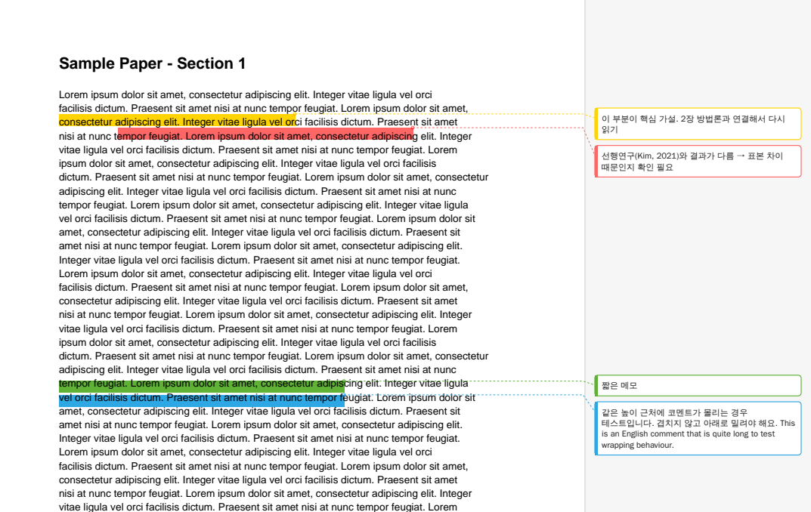

# PDF 코멘트 여백 📝

PDF에 달아둔 코멘트를 **Word처럼 오른쪽 여백에** 보여주는 맥 앱이에요.
PDF를 앱에 끌어다 놓기만 하면 됩니다.



---

## 설치 (처음 한 번만)

1. 이 페이지 위의 초록색 **`Code`** 버튼 → **`Download ZIP`** 을 누릅니다.
2. **다운로드 폴더**에 받은 ZIP 파일을 더블클릭해 압축을 풉니다.
   → `pdf-margin-comments-main` 폴더가 생겨요.
3. 아래 한 줄을 **복사해서** 터미널에 붙여넣고 실행.

```
bash [install_app.sh의 경로].sh
```

`✅ 완료!` 가 나오면 끝. **바탕화면**에 **`PDF 코멘트 여백`** 앱이 생깁니다.

---

## 사용법

PDF 파일을 **`PDF 코멘트 여백`** 앱 아이콘 위에 **끌어다 놓으세요.**
(앱을 더블클릭해서 파일을 골라도 됩니다.)

잠시 후 결과 팝업창이 뜨면 **`결과 열기`** 를 누르세요.
원본과 같은 폴더에 **`원본이름_코멘트.pdf`** 가 만들어집니다.

---

## 참고

- 하이라이트·밑줄·메모에 **적어둔 코멘트**가 여백에 나와요. (텍스트 박스는 빠져요)
- Zotero에서 word형태의 annotation으로 추출이 안돼서 만들게 됐어요.
- 아마도? 다른 앱(미리보기, Acrobat 등)에서 단 주석도 될거에요 (아직 확인 안했어요)
- 원본 파일은 바뀌지 않아요.

MIT License
